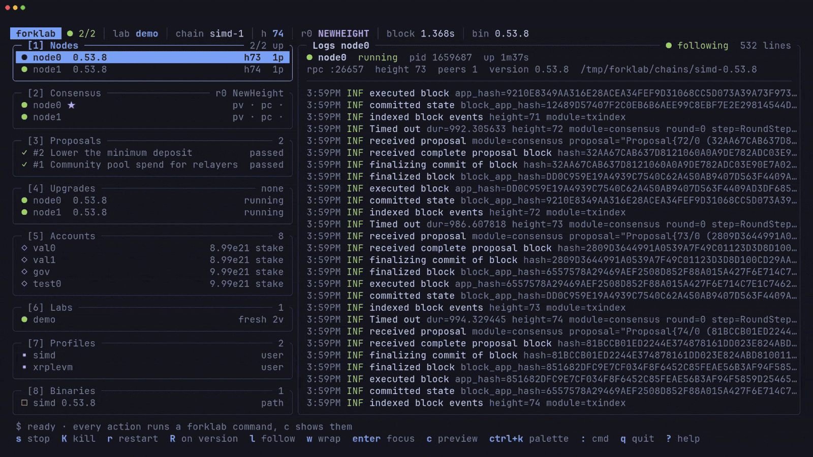
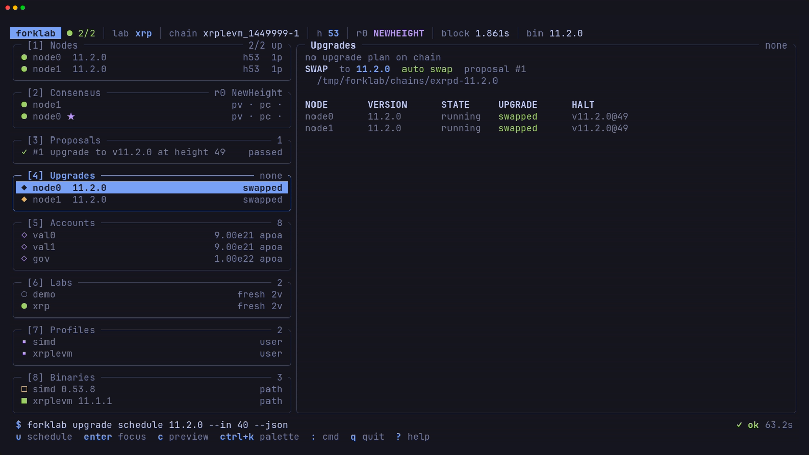

<div align="center">

# forklab

**Rehearse Cosmos SDK chain upgrades on your own machine.**

[](https://github.com/kevinpita/forklab/actions/workflows/ci.yml)
[](https://github.com/kevinpita/forklab/releases)
[](go.mod)
[](LICENSE)

[Features](#features) · [Install](#install) · [Quick start](#quick-start) · [Screenshots](#screenshots) · [Documentation](docs/README.md) · [Releases](https://github.com/kevinpita/forklab/releases)

</div>



forklab runs a local network of N validators for any Cosmos SDK chain, from a
fresh genesis or from mainnet state forked out of a snapshot. Stop nodes, pass
proposals, and swap binaries at the upgrade height from one CLI or a live
terminal UI, so you can rehearse a chain upgrade before it happens for real.

It runs stock chain binaries and never patches the chain. Chain differences
live in [profiles](docs/profiles.md), and two ship built in: `simd` (the
Cosmos SDK example chain) and `xrplevm` (XRPL EVM, binary `exrpd`).

## Features

- **Fresh or forked labs.** Start from the chain's own genesis, or take over
  mainnet state with your validators holding about 90% of the voting power.
- **N validators.** Each node gets its own home, ports, and log. Stop one, kill
  one with SIGKILL, or restart one on another binary.
- **Upgrade rehearsal with auto swap.** `upgrade schedule` submits and votes the
  proposal, then restarts every halted node on the new binary at the plan
  height.
- **Consensus you can see.** Height, round, step, proposer, and each
  validator's prevote and precommit, live or as JSON.
- **Agent-first CLI.** Every command takes `--json`, never prompts, and exits
  with a typed code.
- **A TUI on top of the CLI.** Every screen, form, and action is a
  `forklab ... --json` command, and the TUI shows it before it runs.

## Install

With Go 1.27 or later:

```sh
go install github.com/kevinpita/forklab/cmd/forklab@latest
```

Or download a release archive for Linux or macOS (amd64 or arm64) from the
[releases page](https://github.com/kevinpita/forklab/releases), check it
against `checksums.txt`, and put `forklab` on your `PATH`:

```sh
tar xzf forklab_0.1.0_linux_amd64.tar.gz
install forklab ~/.local/bin/
forklab version
```

> [!NOTE]
> A `go install` build reports its version as `dev`. Profiles with `git` or
> `src` binaries build the chain from source, so they need `git` and Go on the
> machine.

## Quick start

### In the TUI

```sh
forklab
```

With no lab on disk, `forklab` opens a wizard that builds the `lab create`
command as you answer, then offers to bring the lab up. From there, `1`-`8`
switch panels, `Ctrl+K` opens the command palette, `c` shows the commands
behind the current panel, and `?` lists the keys. See the [TUI guide](docs/tui.md).

### From the CLI

```sh
forklab lab create demo --profile simd --version 0.53.8 --validators 2
forklab lab up demo
forklab status
forklab node stop 1
forklab gov submit --template text --title "hello" --auto-vote
```

The `simd` profile builds `simd` v0.53.8 from the cosmos-sdk repository the
first time you use it. To rehearse an upgrade, start an `xrplevm` lab on
11.1.1 and schedule 11.2.0:

```sh
forklab lab create xrp --profile xrplevm --version 11.1.1 --validators 2 --chain-id xrplevm_1449999-1
forklab lab up xrp
forklab upgrade schedule 11.2.0 --in 45
forklab upgrade status
```

> [!TIP]
> Every command accepts `--json` and prints one `{"ok":...}` envelope on
> stdout, so scripts and agents drive forklab the same way you do. See the
> [CLI reference](docs/cli.md).

## Screenshots

**First run.** A seven-step wizard creates your first lab.


**Nodes and live logs.** The left column holds every panel. The main pane
follows the selected node's log.


**Consensus.** The round in progress, vote bars against the 2/3 mark, each
validator's votes, and the peer map.


**Automatic swap.** Both `exrpd` nodes halted at the plan height, and the
supervisor restarted them on 11.2.0.



## Documentation

| Page | Covers |
|------|--------|
| [TUI](docs/tui.md) | Panels, keys, forms, the wizard, themes, the palette, and the command preview |
| [CLI reference](docs/cli.md) | Every command, the `--json` envelope, streams, exit codes, and files |
| [Profiles](docs/profiles.md) | Profile fields, genesis patches, and binary sources |
| [Fork mode](docs/fork-mode.md) | Labs forked from mainnet snapshots |
| [Upgrades](docs/upgrades.md) | Scheduling, automatic and manual swaps, and cancelling |
| [Development](docs/development.md) | Toolchain, recipes, end-to-end tests, and screenshots |
