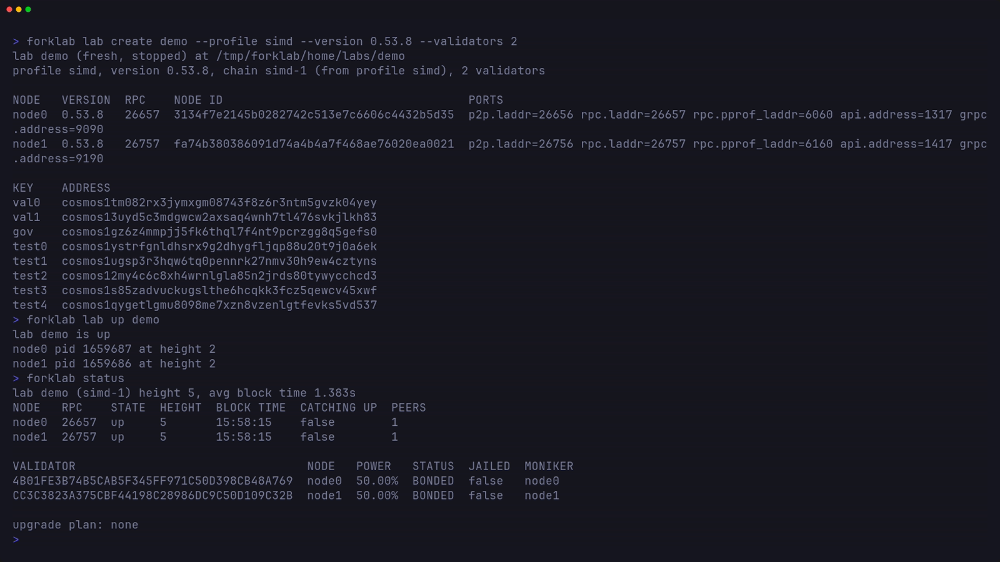

# CLI reference



## A fresh simd lab

The `simd` profile builds `simd` v0.53.8 from the cosmos-sdk repository the
first time you use it.

```sh
forklab lab create demo --profile simd --version 0.53.8 --validators 2
forklab lab up demo
forklab status
forklab node stop 1
forklab node start 1
forklab account list
forklab account send test0 test1 1000
forklab gov submit --template text --title "hello" --auto-vote
forklab gov list
forklab lab down demo
```

The text proposal passes when the `simd` profile's 30s voting period ends, so
run `forklab gov list` again after that to see it as `PASSED`.

## Choosing the lab

Commands that act on a running lab take `--lab <name>` (a lab name or
directory). Without it they use the running lab, or the only lab on disk.

## Commands

| Command | What it does |
|---------|--------------|
| `profile create <name>` | Create a user profile from flags, optionally cloning one with `--from` |
| `profile edit <name>` | Change profile fields; editing a built-in saves a user copy |
| `profile validate <file\|name>` | Validate a profile file or a stored profile |
| `profile list` | List user and built-in profiles |
| `profile show <name>` | Print a profile as YAML |
| `profile delete <name>` | Delete a user profile |
| `binary fetch <version> --profile <p>` | Download or build a binary into the cache |
| `binary build <version> --profile <p>` | Rebuild a `git` or `src` binary |
| `binary list` | List cached binaries |
| `lab create <name> --profile <p> --version <v>` | Create a fresh lab, or a forked one with `--fork` |
| `lab list` | List labs |
| `lab show <name>` | Show nodes, ports, and keys (`--show-mnemonics` for mnemonics) |
| `lab up <name>` | Start the supervisor and nodes and wait for blocks |
| `lab down <name>` | Stop the nodes and the supervisor |
| `lab pause <name> --height <H>` | Freeze at committed application height H while keeping query RPC available |
| `lab resume <name>` | Restore normal node arguments and verify commits resume |
| `lab reset <name>` | Wipe chain data and replay from genesis (`--force` stops the lab first) |
| `lab delete <name>` | Delete a stopped lab |
| `node list` | Show each node's state, pid, uptime, and binary |
| `node start <i\|all>` | Start a node or all nodes |
| `node stop <i\|all>` | Stop with SIGTERM |
| `node kill <i\|all>` | Kill with SIGKILL to simulate a crash |
| `node restart <i\|all>` | Restart, optionally on another binary with `--binary` |
| `node logs <i>` | Print a node's log, `-f` to follow |
| `status` | Node heights, the validator set, and any pending upgrade (`-w` to watch) |
| `consensus` | Height, round, step, proposer, and each validator's votes (`-w` to watch) |
| `account list` | Lab keys, addresses, and balances |
| `account send <from> <to> <amount>` | Send tokens and wait for the block |
| `gov submit [file.json]` | Submit a proposal from a file or `--template text\|upgrade\|params`, `--auto-vote` to vote yes |
| `gov vote <id> <option>` | Vote yes, no, abstain, or veto from lab keys |
| `gov list` | List proposals |
| `gov show <id>` | Show a proposal and its tally |
| `upgrade schedule <version>` | Schedule an upgrade at `--height` or `--in` blocks and swap binaries at the halt |
| `upgrade cancel` | Cancel the scheduled upgrade through governance |
| `upgrade status` | Show the plan and each node's version and swap state |
| `exec -- <bin args>` | Run the chain binary with the lab's home, node, chain id, and keyring |
| `runbook validate <file.yaml>` | Validate a YAML recipe without contacting a chain |
| `runbook show <file.yaml>` | Print a validated recipe as YAML or JSON |
| `runbook write <file.yaml> --document '<json>'` | Validate and save a recipe as YAML, with `--force` to overwrite |
| `runbook run <file.yaml>` | Execute steps in order and save a report, including on execution failure |
| `store <module> <hex-key>` | Inspect raw store bytes, with optional `--height` or `--prefix` |
| `tui` | Open the terminal UI, the same as `forklab` with no command |
| `version` | Print the forklab version |

Run `forklab <command> --help` for every flag. [Upgrades](upgrades.md) and
[Fork mode](fork-mode.md) cover `upgrade` and `lab create --fork` in depth.
[Runbooks](runbooks.md) covers YAML recipes, templates, exact-height pause,
manual resume, and raw store inspection.

## Scripts and agents

forklab is built for scripts and agents as well as people:

- Every command accepts `--json` and then prints one envelope on stdout,
  `{"ok":true,"data":{...}}` or
  `{"ok":false,"error":{"code":"usage","message":"..."}}`.
- Streaming commands (`status -w`, `consensus -w`, `node logs`) print one
  JSON object per line with `--json`.
- Commands never prompt. Missing input is an error that names the flag.
- Exit codes are `0` ok, `1` error, `2` usage, and `3` lab not running.
- Progress and warnings go to stderr.

> [!IMPORTANT]
> Help (`forklab help`, `--help`) always prints text. `forklab` with no
> command opens the TUI, so `forklab --json` alone is a usage error.

## Files

| Path | Contents |
|------|----------|
| `~/.config/forklab/profiles/` | User profiles |
| `~/.forklab/bin/` | Binary cache |
| `~/.forklab/snapshots/` | Snapshot downloads and exports |
| `~/.forklab/labs/<lab>/` | Lab config, keyring and mnemonics, node homes and logs |

Set `FORKLAB_HOME` to move `~/.forklab`. [Profiles](profiles.md#where-profiles-live)
lists the other places user profiles can live.
