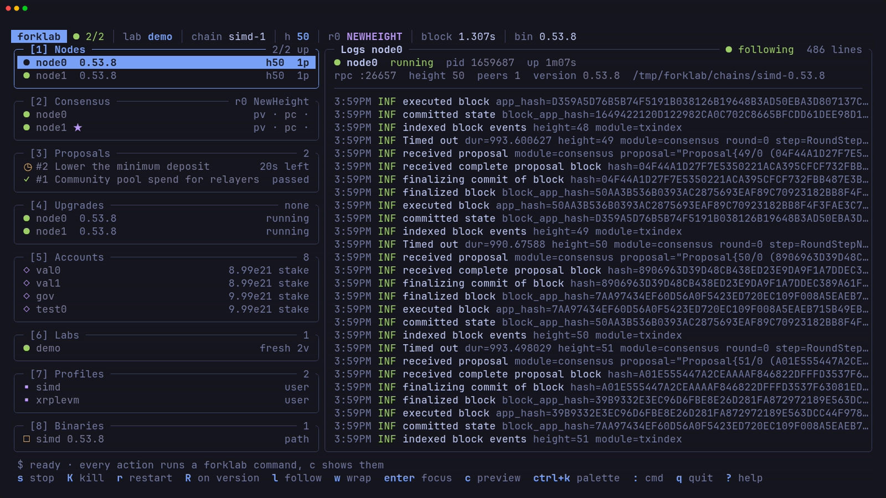
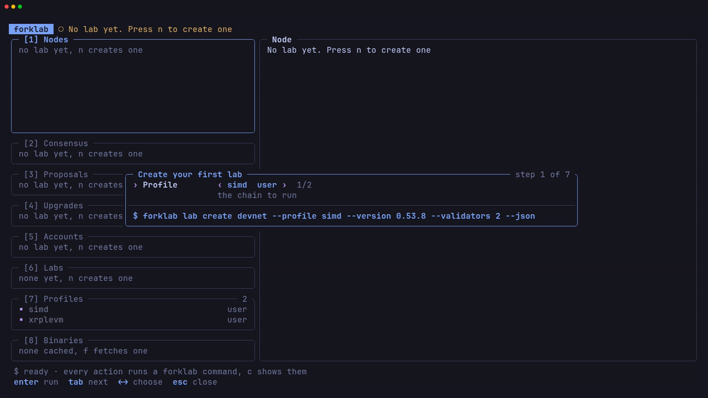
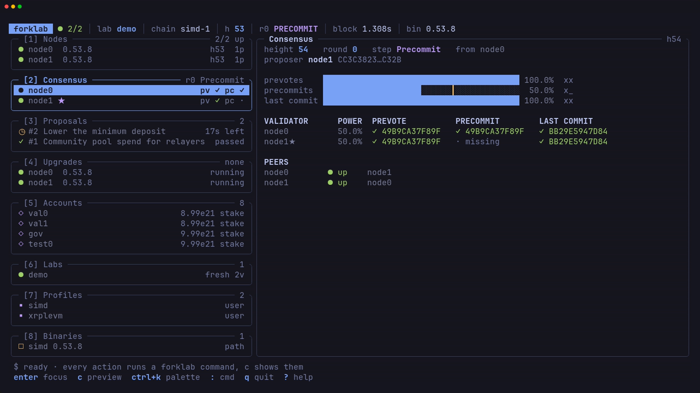
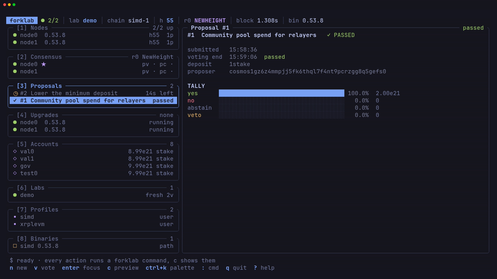
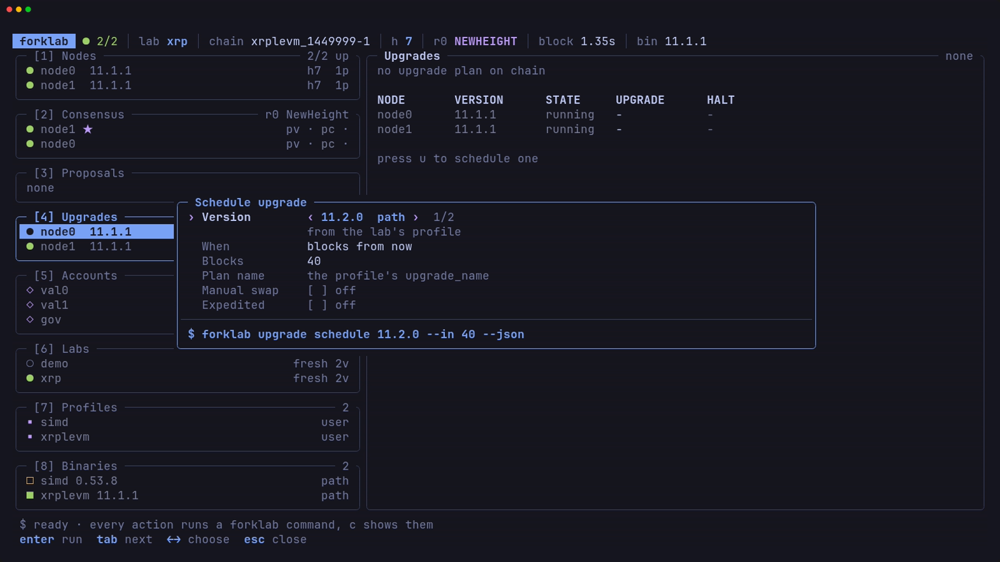
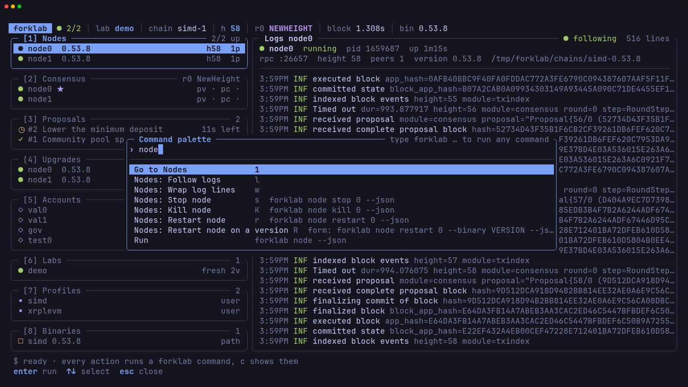
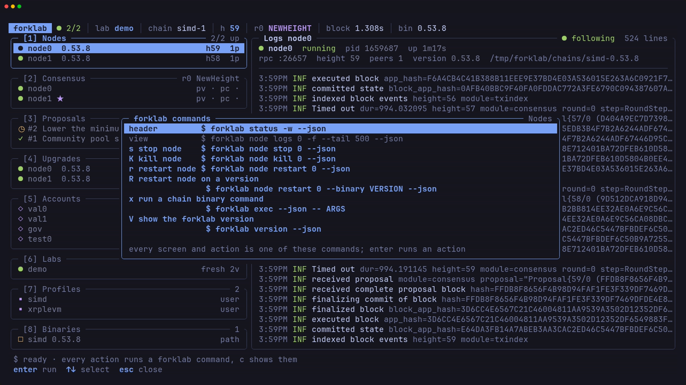

# TUI

`forklab` with no command (or `forklab tui`) opens a keyboard-driven terminal
UI with panels for nodes, consensus, proposals, upgrades, accounts, labs,
profiles, and binaries. Every action runs a `forklab ... --json` command, and
the TUI shows that command before it runs.

## First run

With no lab on disk, `forklab` opens a seven-step wizard that builds the
`lab create` command as you answer (profile, version, validators, fresh or
forked genesis, snapshot, chain id, and name), then offers to bring the lab
up. Close it and press `n` to open it again while no lab exists, or `u` to
start a lab that is down.

## Panels

The left column holds every panel, and `1`-`8` jump to one. The main pane
shows the selected item.

- **Nodes.** Each node's state, and the live log of the selected node.
- **Consensus.** The round in progress, vote bars against the 2/3 mark, each
  validator's votes, and the peer map.
- **Proposals.** Proposals with their status, voting time left, and tally.
- **Upgrades.** The scheduled plan and each node's version and swap state.
- **Accounts.** Lab keys, addresses, and balances.
- **Labs**, **Profiles**, and **Binaries.** Everything on disk.

## Keys

Press `?` for the keys of the focused panel.

| Panel | Keys |
|-------|------|
| Any | `1`-`8` jump to a panel, `Tab`/`Shift+Tab` next or previous panel, `Ctrl+K` palette, `:` run a command, `c` command preview, `x` exec, `Ctrl+R` refresh, `T` next theme, `V` version, `?` help, `q` quit |
| Panel list | `j`/`k` move, `g`/`G` first or last, `Enter` focus the main pane |
| Main pane | `j`/`k` scroll, `PgUp`/`PgDn` page, `g`/`G` top or bottom, `Esc` back to the list |
| Nodes | `s` stop, `S` start, `K` kill, `r` restart, `R` restart on a version, `l` follow logs, `w` wrap |
| Proposals | `n` new proposal, `v` vote |
| Upgrades | `u` schedule, `X` cancel |
| Accounts | `s` send |
| Labs | `n` new, `u` up, `d` down, `R` reset, `D` delete, `m` keys and mnemonics |
| Profiles | `n` new, `e` edit, `v` validate, `D` delete |
| Binaries | `f` fetch, `b` build |

## Forms

Forms cover a new lab, a new or edited profile, an upgrade schedule, a send, a
proposal, a vote, a restart on a version, and a binary fetch or build. Every
form shows the exact command it will run and updates it as you type. `Tab`
and `Shift+Tab` move between fields, `Left` and `Right` change a choice,
`Enter` runs the command, and `Esc` cancels it or keeps a running command in
the background.

This is `u` on the Upgrades panel:

## Command palette

`Ctrl+K` searches every action and shows the command it runs. `:` runs any
forklab command you type.

## Command preview

`c` lists the forklab commands behind the panel. `Enter` runs the selected
one.

## Themes

`--theme` (or `FORKLAB_THEME`) picks `ansi`, `tokyonight`, `catppuccin`, or
`gruvbox`, and `T` cycles them. The default is `ansi`. The screenshots use
`tokyonight`.
