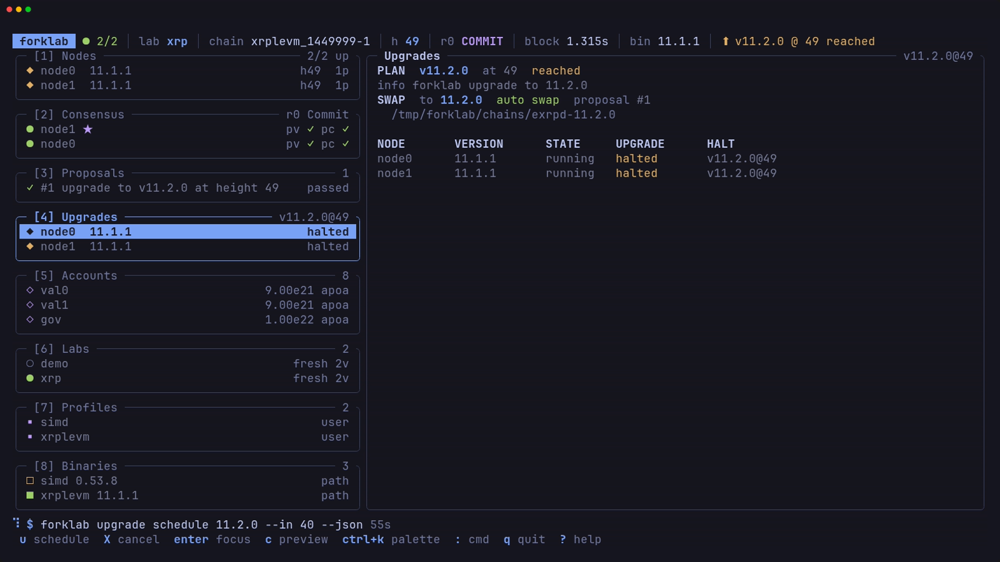

# Upgrades

forklab rehearses a software upgrade end to end: the governance proposal, the
halt at the plan height, and the restart on the new binary.

## Schedule an upgrade

The `xrplevm` profile downloads `exrpd` release binaries. This lab starts on
11.1.1 and upgrades to 11.2.0:

```sh
forklab lab create xrp --profile xrplevm --version 11.1.1 --validators 2 --chain-id xrplevm_1449999-1
forklab lab up xrp
forklab upgrade schedule 11.2.0 --in 45
forklab upgrade status
```

`upgrade schedule` fetches the new binary, submits a software upgrade
proposal, votes it through, and waits. The plan name comes from the profile's
`upgrade_name` unless you pass `--name`. `--height` sets an absolute plan
height instead of `--in`, and `--no-wait` returns as soon as the plan is
registered.

The plan height must be after the end of the voting period, so `--in` must
cover the voting period in blocks plus a small margin. forklab refuses a
height that is too close and names the smallest one that works.

> [!IMPORTANT]
> This fresh lab needs `--chain-id xrplevm_1449999-1`. The XRPL EVM v11.2.0
> upgrade handler does escrow work only on the mainnet chain id
> `xrplevm_1440000-1`, and that work fails on a fresh genesis that lacks
> mainnet state. A [forked lab](fork-mode.md#chain-id) keeps the mainnet id.

In the TUI, `u` on the Upgrades panel opens the same command as a form.

## Automatic swap

When the nodes halt at the plan height, the supervisor restarts each one on
the new binary, and `upgrade schedule` returns once blocks are produced past
that height.

Both nodes halt at the plan height:



The supervisor swaps them to the new binary and blocks continue:


## Manual swap

Use `--no-auto-swap` to leave the halted nodes alone and restart them yourself,
for example to test mixed versions or a restart order:

```sh
forklab upgrade schedule 11.2.0 --in 45 --no-auto-swap
forklab node restart --binary 11.2.0 0
forklab node restart --binary 11.2.0 1
```

## Status and cancel

`forklab upgrade status` shows the scheduled plan and each node's version and
swap state. `forklab status` also lists any pending upgrade.

`forklab upgrade cancel` cancels a scheduled plan through governance.

## Expedited proposals

Upgrade and cancel proposals are regular proposals by default. Pass
`--expedited` to `upgrade schedule`, `upgrade cancel`, or `gov submit` to
submit an expedited one. forklab then uses the chain's expedited voting period
and expedited minimum deposit, so the smallest valid `--in` shrinks. The
built-in profiles set the expedited voting period to 20s.

## Reset after an upgrade

`forklab lab reset <name>` wipes every node's chain data so the lab replays
from genesis. Replaying needs the binary the lab was created with, so reset
puts every node back on that version and forgets any pending upgrade. Keys and
genesis stay. The lab must be down, or pass `--force` to bring it down first.
Run the same rehearsal again after a reset.
